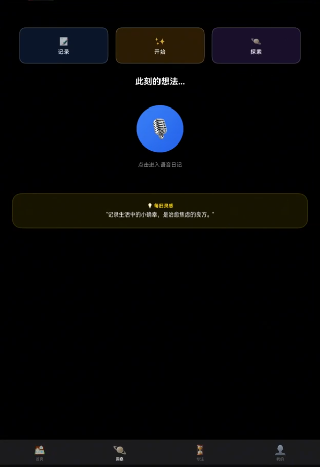
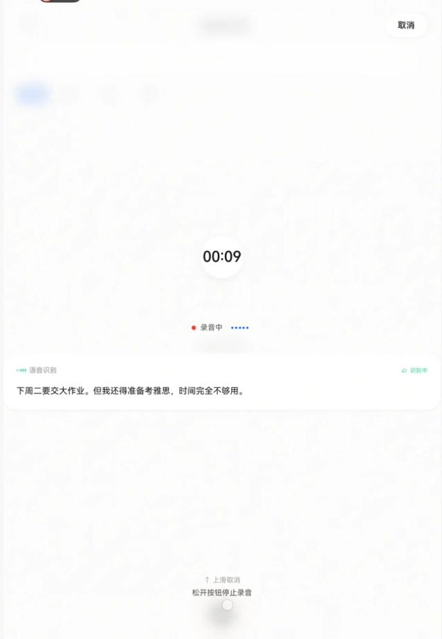
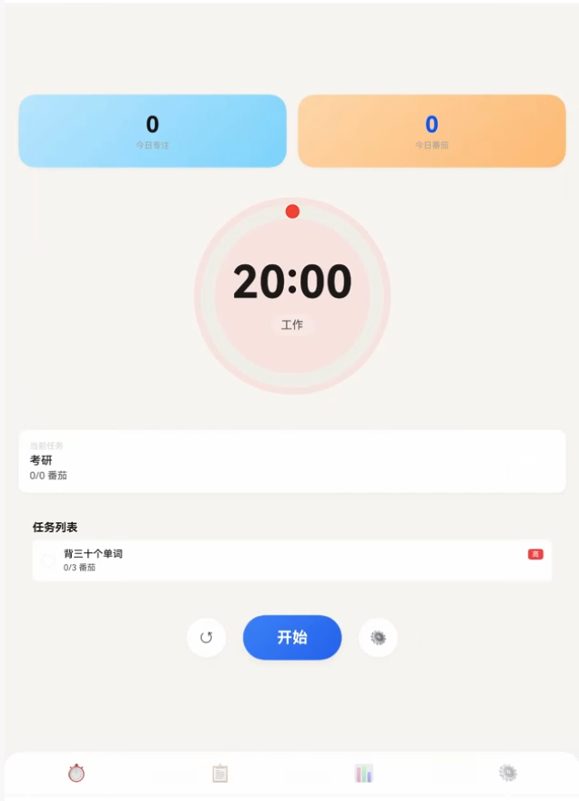
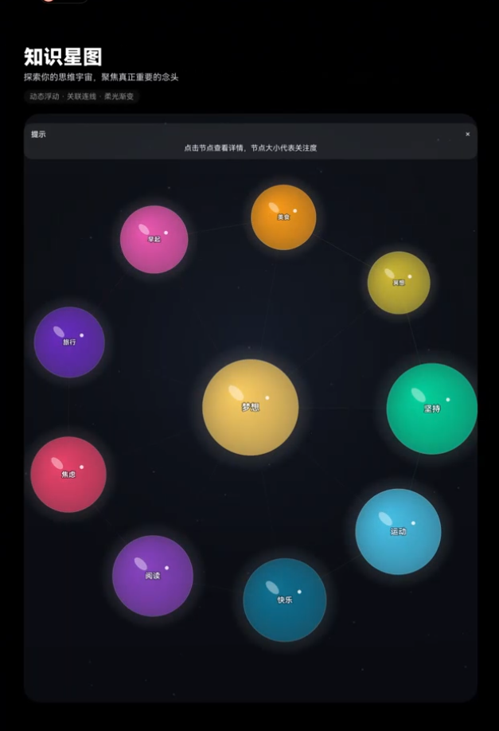

<div align="center">

# Smart Study OS

**A voice-first HarmonyOS learning companion that turns spoken reflections into structured study records.**

`HarmonyOS` · `ArkTS` · `ArkUI` · `AGC CloudDB` · `Cloud Functions` · `GLM`

</div>

<table>
<tr>
<td width="50%"></td>
<td width="50%"></td>
</tr>
<tr>
<td width="50%"></td>
<td width="50%"></td>
</tr>
</table>

Smart Study OS connects diary capture, AI-assisted interpretation, task planning and cloud persistence in one HarmonyOS application. A spoken entry can become a goal, a task, a note and a future focus session without being manually rewritten across separate tools.

## Highlights

- **Voice diary to structured data** — transcripts are interpreted into goals, tasks, notes and emotional context.
- **Study planning** — extracted goals feed task and pomodoro workflows.
- **Cross-surface continuity** — records stay consistent across the phone interface, floating window and cloud.
- **Knowledge galaxy** — recurring concepts from diary entries become an explorable weighted visual map.
- **HarmonyOS integration** — background tasks, floating windows, notifications and AGC services are part of the application flow.

## From reflection to action

```text
Speak or type a diary entry
            │
            ▼
  transcription + emotion signal
            │
            ▼
intent extraction: goals · tasks · notes
            │
            ├────────► pomodoro and floating tools
            │
            └────────► CloudDB study record
                              │
                              ▼
                  history and knowledge galaxy
```

## Core modules

| Module | Responsibility |
| --- | --- |
| Voice Diary | Recording, transcription and structured entry creation |
| Study Planning | Tasks, goals and pomodoro records |
| Cloud Data | CloudDB persistence, synchronisation and cloud functions |
| Floating Tools | Calculator and pomodoro controls above other applications |
| Knowledge Galaxy | Keyword-based visual navigation across diary history |
| AI and Reading | GLM-assisted interpretation and a configurable news feed |

## Run in DevEco Studio

1. Open `Application/` in DevEco Studio and synchronise the ArkTS dependencies.
2. Configure a HarmonyOS device or emulator running OS 5.0.0(12)+.
3. Add your AppGallery Connect configuration and create a signing profile.
4. Build and run the `entry` module.

<details>
<summary>Cloud and service configuration</summary>

- Place `agconnect-services.json` in `Application/entry/src/main/resources/rawfile/`.
- Deploy `id-generator` and `send-code` from `CloudProgram/cloudfunctions/`.
- Import the CloudDB object types in `CloudProgram/clouddb/`.
- Configure the GLM key in `common/services/GLMService.ets`.
- Configure Baidu NLP credentials in `common/utils/EmotionAnalyzer.ets`.
- Configure the news API in `common/services/NewsService.ets`.

Empty optional-service credentials disable the corresponding integration. Signing files and private service credentials are not committed.

</details>

## Repository structure

```text
Application/                 HarmonyOS application
Application/entry/           UI, view models and application resources
Application/common/          shared services, models and utilities
CloudProgram/cloudfunctions/ AGC cloud functions
CloudProgram/clouddb/        CloudDB object definitions
docs/                        portfolio screenshots
```

## Project context

**Role:** Project Lead in a three-person team. Owned the voice-diary and cloud-data module, connecting speech input and AI-assisted extraction to persistent learning records.

[Xueji](https://github.com/shixiang-liu/xueji-harmonyos) is a second reflective-learning application built on the same technical foundation.

## License

See [LICENSE](LICENSE) for portfolio and evaluation terms.
